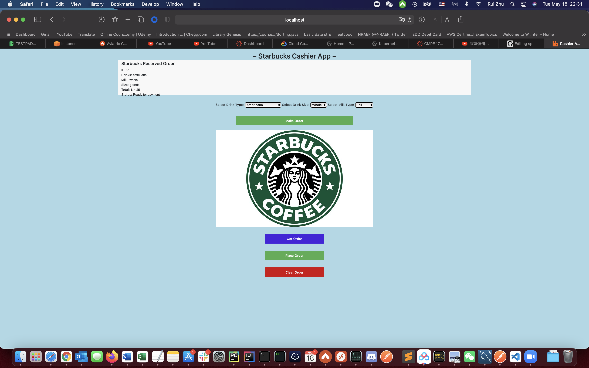
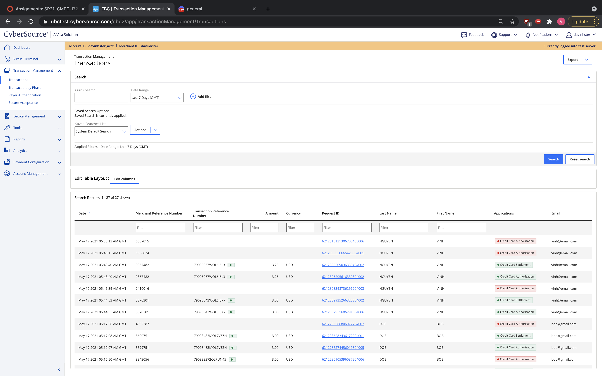
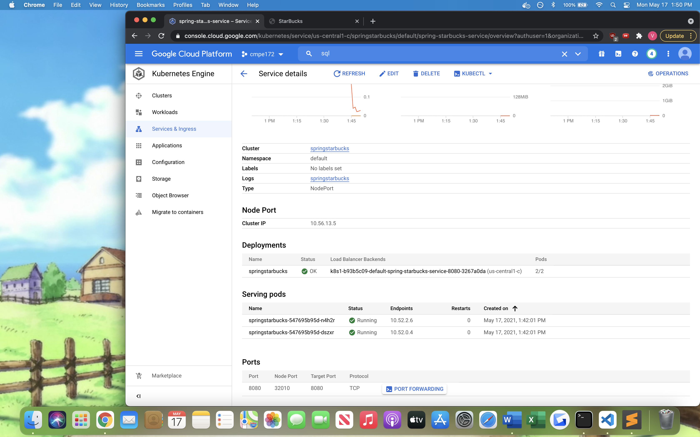
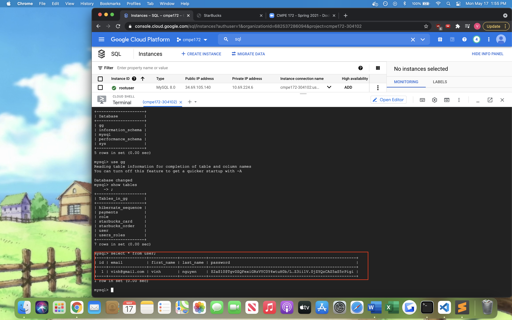
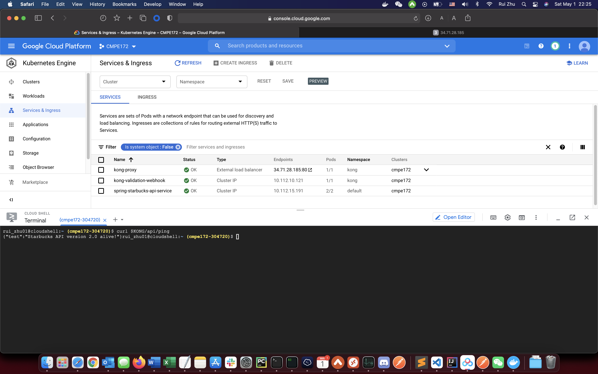

# Team Project Repo

https://github.com/nguyensjsu/sp21-172-team-e

## Team Name
Team E

## Individual reports will be under the folder "Weekly Reports" 

## Architecture Diagram

Users connect to app using a browser. The browser connects to the Bootstrap frontend app which is running on GCP through a load balancer. The frontend app run on a GKE Kubernetes cluster that can be auto scaled.

The Bootstrap frontend app connects to backend deployed on GCP through Kong API gateway. The API gateway has 10 routes, one for each of the microservices deployed on individual requirement.

## Cashier's App
The Cashiers App will be used by our Baristas at each Starbucks store front. Orders will taken directly from the customer and entered into the Cashier's app.
Cashier's app will call the Starbucks order API to get or delete current order. There is also a mini menu that allow employees to make new order and pay by card. 

## Backoffice Help Desk App
What features were implemented?

## Online Store 

#### * Login page
An entry page to Starbucks website that requires user identification and authentication.
User should enter username and password in order to login.

#### * Registration page
A registration page enables users to independently register and gain access to our Starbucks system. User have to enter First Name, Last Name, email, and password to finish the register form.

#### * Menu page
Customer can choose drinks from Menu. Right now we only support four drinks: Frappuccion, Cappuccion, Latte and Fresh Coffee.

#### * Payment page
We reuse lab 7 code, build a Spring Payments Page and adding Server Side Form Validation and integration with the CyberSource Payments Gateway. Customer can pay the coffee in this page with their credit card.

#### * SSO via Okta
SSO via Okta button is in on login page and ready to use

Click on the Okta Login Button will redirect to the okta sign-page

Once granted authorization from okta, it will redirect back and show the login user's name(okta account name), like "Welcome [okta_account name]"

The logged in user's info is stored into MySQL database to make sure to recognized the old users

## REST API 

GET /ping 
request: 
http://localhost/ping
response:
Ping Health Check.

{ 
  "Test": "Starbucks API version 1.0 alive!" 
}  

GET /cards  
request: 
http://localhost:8080/cards
response:
Get a list of Starbucks Cards (along with balances).

[ 
  { 
    "CardNumber": "498498082", 
            "CardCode": "425", 
            "Balance": 20, 
            "Activated": false, 
            "Status": "" 
          }, 
          { 
            "CardNumber": "627131848", 
            "CardCode": "547", 
            "Balance": 20, 
            "Activated": false, 
            "Status": "" 
          } 
        ]        

POST /cards
request: 
http://localhost:8080/cards
response: 
Create a new Starbucks Card.

        { 
          "CardNumber": "498498082", 
          "CardCode": "425", 
          "Balance": 20, 
          "Activated": false, 
          "Status": "New Card." 
        }

GET     /cards/{num} 
request: 
http://localhost:8080/cards/627131848
response:
Get the details of a specific Starbucks Card.

        { 
          "CardNumber": "627131848", 
          "CardCode": "547", 
          "Balance": 20, 
          "Activated": false, 
          "Status": "" 
        }        

POST     /card/activate/{num}/{code} 
request: 
http://localhost:8080/cards/627131848/547
response:
 Activate Card 

        { 
          "CardNumber": "627131848", 
          "CardCode": "547", 
          "Balance": 20, 
          "Activated": true, 
          "Status": "" 
        }

POST    /order/register/{regid} 
request: 
http://localhost:8080/order/register/001

        { 
          "Drink": "Latte", 
          "Milk":  "Whole", 
          "Size":  "Grande" 
        }     
response:
Create a new order. Set order as "active" for register.

Response:

        { 
          "Drink": "Latte", 
          "Milk": "Whole", 
          "Size": "Grande", 
          "Total": 2.413125, 
          "Status": "Ready for Payment." 
        }        

GET     /order/register/{regid} 
request: 
http://localhost:8080/order/register/001
response:

 Request the current state of the "active" Order.

        { 
          "Drink": "Latte", 
          "Milk": "Whole", 
          "Size": "Grande", 
          "Total": 2.413125, 
          "Status": "Ready for Payment." 
        }

DELETE  /order/register/{regid} 
request: 
http://localhost:8080/order/register/001
response:

Clear the "active" Order.

        { 
          "Status": "Active Order Cleared!" 
        }

POST    /order/register/{regid}/pay/{cardnum} 
Process payment for the "active" Order.
request: 
http://localhost:8080/order/register/001/pay/627131848
response: 

        Response: (with updated card balance)

        { 
          "CardNumber": "627131848", 
          "CardCode": "547", 
          "Balance": 15.17375, 
          "Activated": true, 
          "Status": "" 
        }

GET     /orders 
Get a list of all active orders (for all registers)
request: 
http://localhost:8080/orders
response: 

        { 
          "5012349": { 
            "Drink": "Latte", 
            "Milk": "Whole", 
            "Size": "Grande", 
            "Total": 4.82625, 
            "Status": "Paid with Card: 627131848 Balance: $15.17." 
          } 
        }

DELETE     /cards 
Delete all Cards (Use for Unit Testing Teardown)

request: 
http://localhost:8080/cards
response: 
        { 
          "Status": "All Cards Cleared!" 
        }

DELETE     /orders 
request: 
http://localhost:8080/orders
response: 
Delete all Orders (Use for Unit Testing Teardown)

        { 
          "Status": "All Orders Cleared!" 
        } 
        

## Integrations 
Which integrations were selected?
* We used Cybersource for handling user's online transaction when purchasing drinks
  * 
  * 

## Cloud Deployments
* Deployment pod screenshots
  * 
  * 
* Service screenshots
  * 
  * 
  * 
* Load balancer Ingress screenshots
  * 
  * 
* MYSQL screenshots
  * 
  * 
* Results 
  * 

### Kong API Gateway
* Deployment pod screenshots
  * 

* Service screenshots
  * 

* Jumpbox
  * 

* ingress-controller
  * 

* Test Kong Api Endpoint
  * 

* Apply API key
  * 

* ping test from postman
  * 

Design Notes on GitHub an Architecture Diagram of the overall Deployment.
* Our cloud deployment allows users to purchase items through our online store. We have a loadbalancer so that we can control the traffic of users when they want to buy drinks
How does your Team's System Scale?  Can it handle > 1 Million Mobile Devices?
* As long as we can pay for the storage for user accounts, orders, rewards... and pay more money for more scaling the servers up to allow 1 million concurrent users, then it is possible.

## Technical Requirements
Discussion with screenshot evidence of how each technical requirement is meet.
* Cashier's App met, screenshots above
* Backoffice Help desk met, screenshots above
* Online store met, screenshots above
* REST API met, rest commands above
  * Screenshot one example of our API, GET cards 
    * 
* Integrations met via Cybersource, screenshots above
* Cloud deployments met, screenshots above

