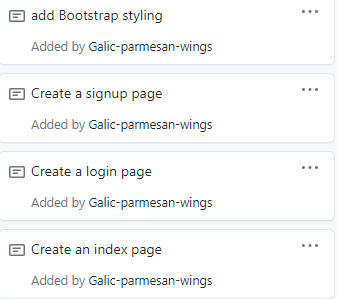

## Fenglin Zhang Week 1 Report

### notes:

Since there are a couple of compile errors when run the project, the index, sign and login page pushed was tested on local machine. Need more time to investgate how those pages fit for the project

###
* 

### Accomplishment

This week, I finished Starbucks Card service API with a H2 database.

https://github.com/nguyensjsu/sp21-172-team-e/commit/e959803301a9a9a4f22614aeedb658e3689db0bb

For next week, I will convert h2 database to mysql database.
### API Documentation
#### Starbucks cards service

https://github.com/nguyensjsu/sp21-172-team-e/commit/f3b6c6049800aef46ee45fcbf19f07124a1be90e

### Challenge 

