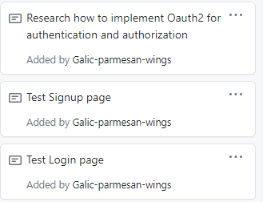

# Week 2 Notes for Fenglin Zhang

### self notes
* Get to know how jQuery work with Spring MVC and Thymleaf

# Snapshot
* 

# Discussion

## Accomplishments 
* Got homepage and Navbar done and find a way to nest a reusable html fragment into another html page.
  https://github.com/nguyensjsu/sp21-172-team-e/pull/10/commits/34dbda87efe68fde1e3e8fc7d2ef416a6e32a9c9
## Challenges

* By watching the tutorial videos on Youtube, I figured out how to insert a html fragment into another one. Like th:replace="navbar::navbar"
* Need a recap on CSS layout and grid to craft a nice log in and sign up page
* Still NEED a review on Spring security to stick all pieces together such as controllers, configurations and views.
