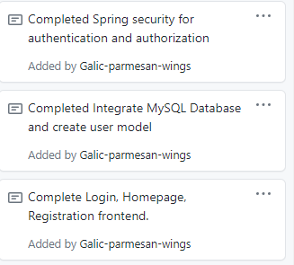
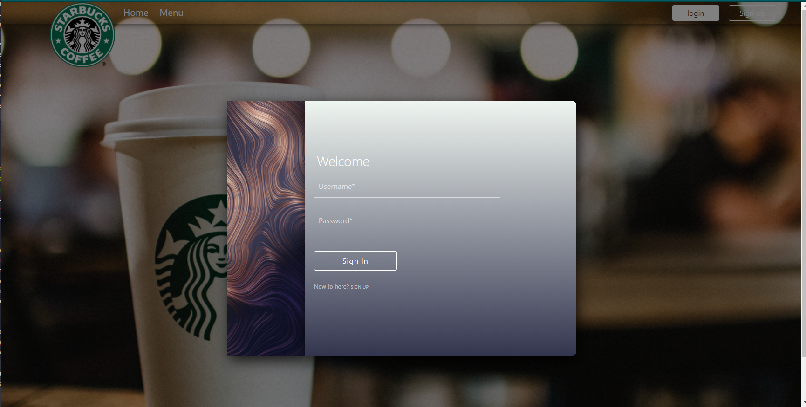

# Week 2 Notes-----Fenglin Zhang

### self notes
* Connect the modal fragments nested in login and sign modal
* Integrate with Okta SSO

# Snapshot
* 
* 
# Discussion

## Accomplishments 
* First, configure application.property to connect MySQL and create user and role model
* Second, use DAO pattern to build communication between databases and http request
* Third, optimized frontend more responsive with css and js
  https://github.com/nguyensjsu/sp21-172-team-e/pull/10/commits/34dbda87efe68fde1e3e8fc7d2ef416a6e32a9c9
## Challenges

* Bootstrap modal is hard... need to read documentation many times
* OOP design patterns is also hard, Gotta watch a couple of tutorials for that
* It is easy to access the authorized username, but I need to display like "WELCOME <HIS USERNAME><Instead of His email>", so I find a way to make the username as a Global Model attribute on Stack Overflow
