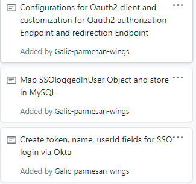
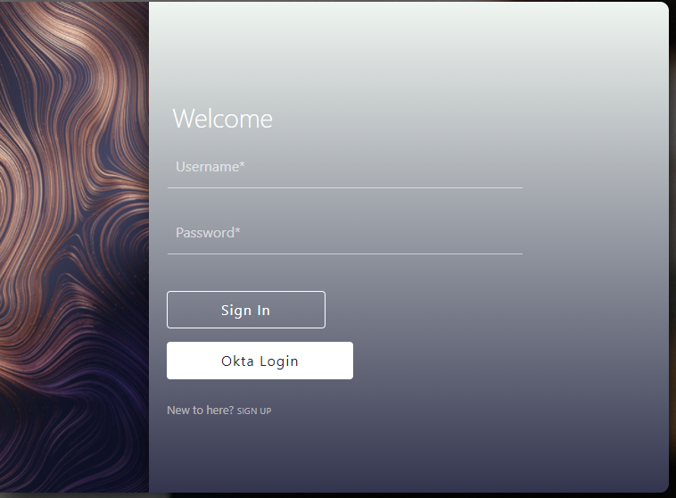
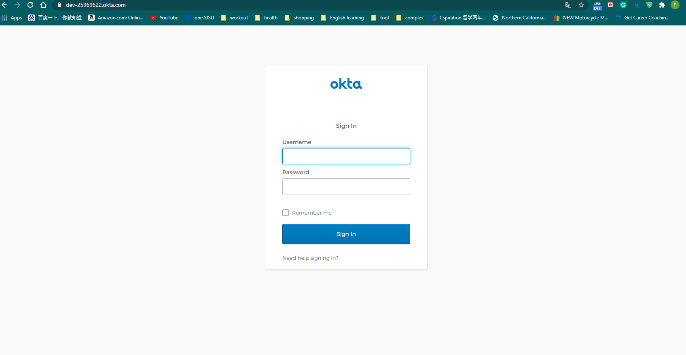
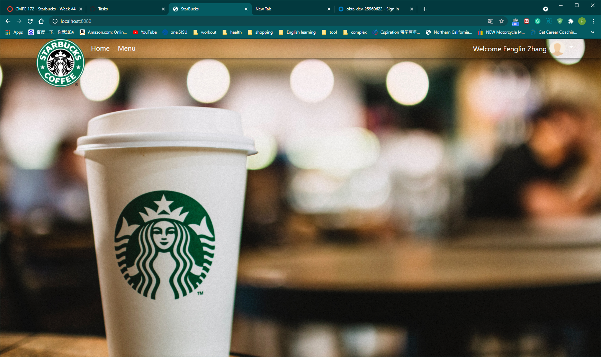

# Week 4 Notes-----Fenglin Zhang

### self notes
* need to create backoffice listening to localhost:8081
* Add spring security to the backofficeCancel changes

## Snapshots
* Task Card

* Add okta login button

* click the button, direct to login/oauth2/authrization/okta for sso login via okta

* redirect back with showing the loggedIn User name

## Accomplishments 
* First, configure application.property to connect with okta client server, and generate token, userId, authName fields for sso via okta
* Second, implement save() method to save logged-In-User by sso via okta
* Third, modify webSecurity configuration to allow oauth.login(), and customize authrization endpoints and redirection endpoints 
  https://github.com/nguyensjsu/sp21-172-team-e/commit/d4cf7684966e233275a487ead820939ef1b14da7
## Challenges

* Extremely hard to figure out how to store sso loggedIn user to the database.
* configure the sso login routing so that my custom form login won't be emitted.
* Have a hard time to access sso loggedIn user object to extract his/her name.
