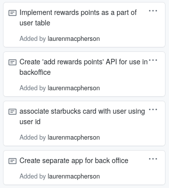

[Link to Pull Request]()

## Week 4 Report ##

## My Task Cards ##

1. Implement rewards points as part of user table 
2. Create 'add rewards points' API for use in backoffice
3. Associate starbucks card with user using user id 
4. Create separate app for back office 

## Implement Rewards Points ##

I added the rewards points designation to the user model, assigned setters and getters, etc. When a new user is made they are initialized with 0 reward points. 

## Create 'Add Rewards Points' API 

## Associate Starbucks Card with User ##
