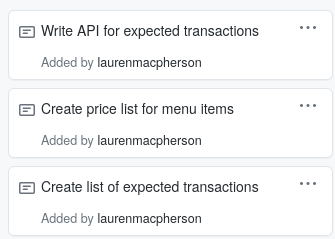

## Week 1 Report ##

This week, Rui and I both worked on the API. We mutually decided that he would work on the Starbucks Cards, and I would work on the orders. 

### My Task Cards ###

My tasks were to: 
1. Create a list of expected transactions 
2. Create a price list for menu items 
3. Write API for expected transactions. 

### Task 1: Create a list of expected transactions ###

From the project page, there was a list of expected APIs we would need to use. We could edit these as needed, but this provided a good base for what we would be making. 

**POST    /order/register/{regid}**
Create a new order. Set order as "active" for register.

**GET     /order/register/{regid}**
 Request the current state of the "active" Order.

**DELETE  /order/register/{regid}**
Clear the "active" Order.

**POST    /order/register/{regid}/pay/{cardnum}**
Process payment for the "active" Order. 

**GET     /orders**
Get a list of all active orders (for all registers)

**DELETE     /orders**
Delete all Orders (Use for Unit Testing Teardown)

Once we have gotten further into the project, I may revise this list of transactions if we find another kind of transaction we need. 

### Create a price list of expected transactions ###

I found this [list of Starbucks items and prices](https://www.fastfoodprice.com/menu/starbucks-prices/). I will reference it while I make the orders and prices. 

The drinks we'll offer are listed below, with the prices listed as (tall, grande, venti/customer's cup). 

**Current items (referenced from webpage offerings so far)**
Frappe (4.75, 5.25, 5.75)
Cappucino (3.25, 3.95, 4.25)
Latte (3.25, 3.95, 4.25)
Fresh Coffee (1.95, 2.45, 2.75) 

**Proposed future items**
Iced Coffee (2.25, 2.75, 3.25) 
Cold Brew (2.95, 3.65, 3.95)
Espresso (1.95, 2.25, 2.65) **note, this is for single, double, or triple shot**

