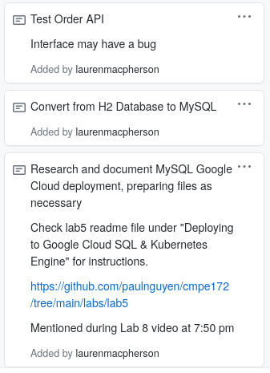
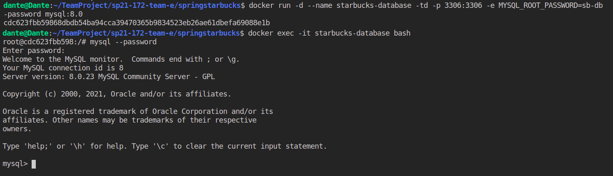
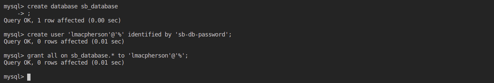
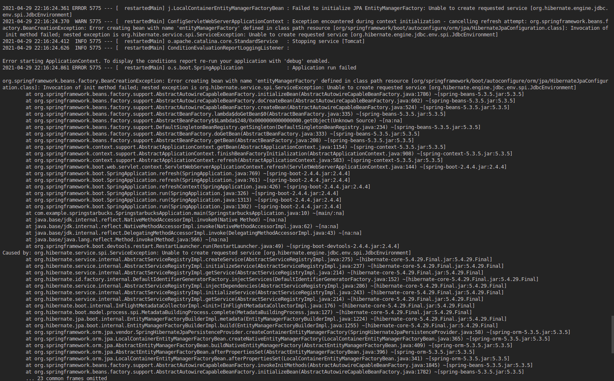

## Week 2 Report ##

This week, my focus was on fixing any issues with the Order API, as well as converting from the H2 database configuration we started with to a MySQL database. I also know that we need to deploy our database to Google Cloud, so I will be looking over the documentation shared in Lab 5 regarding this process and taking steps as necessary. From a quick look-over, it seems like most of the steps will be taking place once we actually deploy it in the cloud, not edits to the files themselves. Still, I'm going to prepare for that. I will also be looking over the project requirements again and adding more cards. 


### My Task Cards ###



My tasks were to: 
1. Test Order API 
2. Convert from H2 Database to MySQL 
3. And research/document MySQL GC deployment 

### Test Order API 

I communicated with my team and found that there were some issues with our previous API implementation that have now been resolved. I will be using our current API and removing old, commented code and saving it locally to my machine.

###Convert from H2 Database to MySQL  

The subject of using a MySQL database instead of an H2 was covered in the midterm practice. Some relevant information for future reference: 

For use in the terminal to build the project: 

```
sdk use gradle 5.6 
sdk use java 11.0.10.j9-adpt 
```

For testing purposes, connecting MySQL as root and allowing access to user from all hosts (this should not be used in our final copy) 

```
docker run -d --name starbucks-database -td -p 3306:3306 -e MYSQL_ROOT_PASSWORD=sb-db-password mysql:8.0
```

Docker command to access MySQL Container: 
```
docker exec -it mysql bash
starbucks-database --password
```

MySQL prompt commands: 
```
mysql> create database db_example; -- Creates the new database
mysql> create user 'springuser'@'%' identified by 'ThePassword'; -- Creates the user
mysql> grant all on db_example.* to 'springuser'@'%'; -- Gives all privileges to the new user on the newly created database
```

Terminal testing prompts, change parameters as necessary: 
```
curl localhost:8080/demo/add -d name=First -d email=someemail@someemailprovider.com
curl 'localhost:8080/demo/all'
```

Once the database is completed, remember to edit user permissions for the user that created the database. 



Creating database:


Now testing commands: 

Error: run into curl (7) error from below. Trying to run the application via gradle bootRun:



For that reason, I will be keeping this branch un-merged until I resolve this issue. 

## Possible issues/errors: 

```
curl: (7) Failed to connect to localhost port 8080: Connection refused
```

Try: 
* ./gradlew bootRun
* run the application in one terminal, use curl commands in the other
* docker restart mysql- when mysql is exited incorectly, two MySQL servers attempting to be run on the same port 

