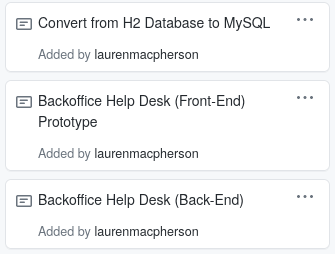

[Link to Pull Request]()

## Week 3 Report ##

### My Task Cards ###

My tasks were to: 
1. Convert H2 Database to MySQL 
2. Backoffice Help Desk (Front-End) Prototype 
3. Backoffice Help Desk (Back-End) 

### Convert from H2 Database to MySQL ###

My version from last week wasn't working. I decided to roll back to main to see if it would build correctly without the MySQL changes, and it worked. I worked on this using the same premise from last time but with additional reference material. I used this: 

###
