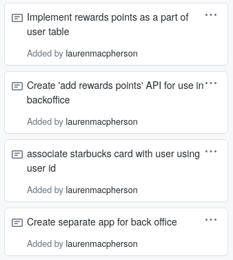

[Link to Pull Request](https://github.com/nguyensjsu/sp21-172-team-e/pull/13)

## Week 4 Report ##

Along with my task cards, I also added the base apps for backoffice and cashier's app, based on a clarification on how these parts of the project should be structured. I copied some of the code from our spring starbucks app into the backoffice as I believed that code would be useful. Because I changed the location of the files though, there may be package statement issues to resolve. 

## My Task Cards ##

1. Implement rewards points as part of user table 
2. Create 'add rewards points' API for use in backoffice
3. Associate starbucks card with user using user id 
4. Create separate app for back office 

## Implement Rewards Points ##

I added the rewards points designation to the user model, assigned setters and getters, etc. When a new user is made they are initialized with 0 reward points. 

## Create 'Add Rewards Points' API 

After evaluating how reward points would be added, I first added some lines to the order API to make sure that purchases resulted in reward points being added. 

Then, I added the 'add reward points' API to the backoffice. We would only be using that specific API (inputting a user and an amount of reward points to add) in the backoffice itself, as a way for employees to add missing points. The API still needs testing and error handling. 

## Associate Starbucks Card with User ##

I used email instead of ID, as I felt like it would be more useful to look up the cards by the user's email than the user's ID. The line setting this is still commented out in StarbucksCardController. 

## Create Separate App for Back Office ## 

I created base apps for both back office and cashier's app, but put more work into Back Office so far. I added the application properties and transferred over some aspects from the spring starbucks app that I thought might be useful, such as the card model, controller, and repo and some of the files handling user. As the user was previously used solely for login, I am assuming there will need to be a lot of re-naming and restructuring the files such that the backoffice treats this 'user' (customer) as an entity to be edited, rather than as something for the SSO login. The files do not build yet. 
