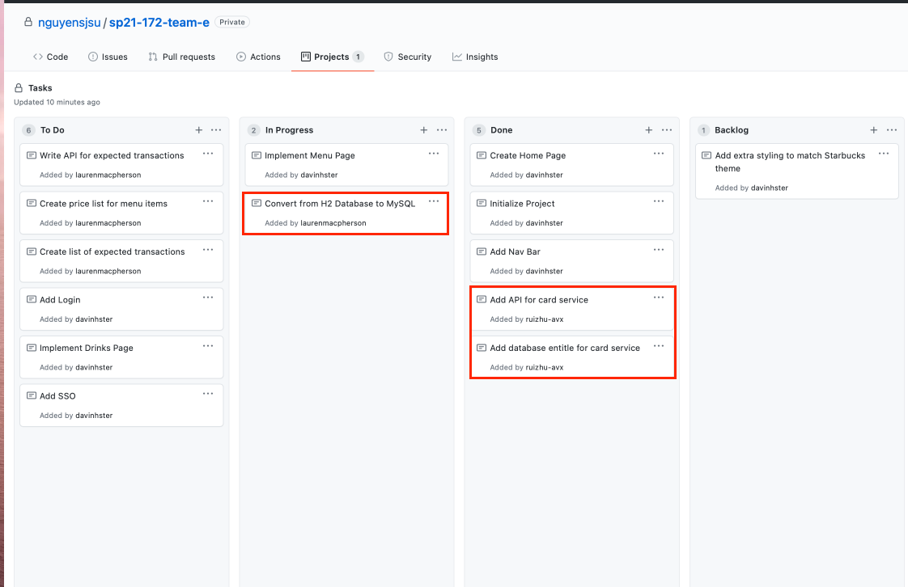

## Rui Zhu Week 1 Report

### notes:

First Week, Lauren and I worked on the Starbucks api part. I will work on the Starbucks Cards service API, and Lauren will work on the Oreder service API.

###
* 

### Accomplishment

This week, I finished Starbucks Card service API with a H2 database.

https://github.com/nguyensjsu/sp21-172-team-e/commit/e959803301a9a9a4f22614aeedb658e3689db0bb

For next week, I will convert h2 database to mysql database.
### API Documentation
#### Starbucks cards service

1.	Health check [GET]
http://localhost:8080/ping
2.	Get all the starbucks card [GET]
http://localhost:8080/getcards
3.	Create a new Starbucks Card [POST]
http://localhost:8080/newcard?cardNumber=498498082&cardCode=425&balance=20.0&activated=false&status=New card
4.	Find specific Starbucks card [GET]
http://localhost:8080/findcard/?cardnumber=498498082
5.	Activate specific Starbucks card [POST]
http://localhost:8080/card/activate/?cardnumber=498498082&code=425
6.	Delete all Starbucks cards [DELETE]
http://localhost:8080/cards

### Challenge 
This task is very similar to the Lab 6, but I didn't do well on it. I have to learned Spring Rest API from https://spring.io/guides/tutorials/rest/, and finally finished my card api version 1.
While I was working on the API, I put WebController and APIController together，but later I realized I should split them to make our structure more clear.