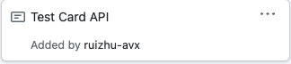
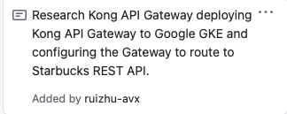

## Rui Zhu Week 1 Report

### notes:

This week, I worked on testing Order API and Kong API Gateway. For this project, we need to deploy a Kong API Gateway to Google GKE and configuring the Gate to route to our Starbucks REST API. In addition, I will need to add API Key Authentication to our API and test our API via Postman.

### My Task Cards

* 
* 

PR: https://github.com/nguyensjsu/sp21-172-team-e/pull/8

#### Test Order API
I fixed some routing issue and tested the Starbucks Card REST API from Postman. All API can run successfully.

#### Kong API Gateway

[Install Kong](https://konghq.com/install)
[Install Kong on Local Docker](https://hub.docker.com/_/kong)

* Create Kong Docker Network
* Run Starbucks API in Docker
* Run Kong Docker in DB-Less Mode
* Deploy Kong on Google GKE
* Build and Push Your Starbucks API Docker Image to Docker Hub
* Deploy Starbucks to GKE
* Create a Service for Starbucks API
* Install Kong GKE Ingress Controller
* Create an Ingress rule to proxy the Starbucks Service
* Test Kong API Ping Endpoint
* Add Kong Key-Auth PlugIn
* Configure an API Client Key
* Test Your API Against Kong via Public IP of Load Balancer

