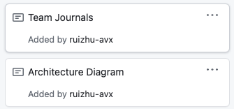
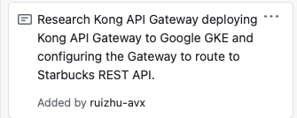
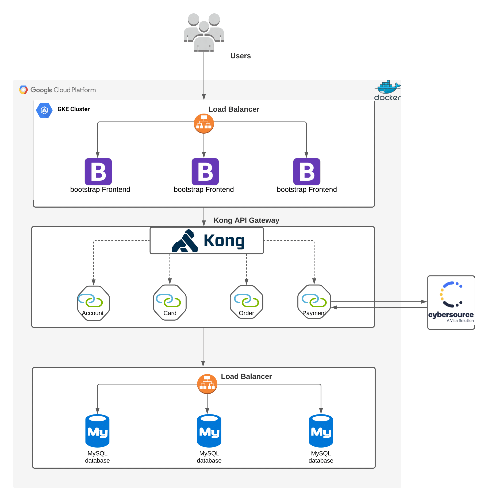

## Rui Zhu Week 3 Report

### notes:

* Need to update kong api gateway once once we convert the database from H2to mysql. 
* Need to create more UML Diagrams.
### My Task Cards

* 
* 

https://github.com/nguyensjsu/sp21-172-team-e/commit/5170967e318a942d944f395ef927ce3ebee8a2c3

#### System Architecture Diagram

Users connect to app using a browser. The browser connects to the Bootstrap frontend app which is running on GCP through a load balancer. The frontend app run on a GKE Kubernetes cluster that can be auto scaled.

The Bootstrap frontend app connects to backend deployed on GCP through Kong API gateway. The API gateway has 10 routes, one for each of the microservices deployed on individual requirement.

#### Plan to next week
Connect Cybersource for online payment.Add Server Side Form Vaildation and integration with CyberSource Payments Gateway. I can reuse Lab #7 starter code include Java API Proxy with abstracts all the HTTP REST API and Security functionality.

