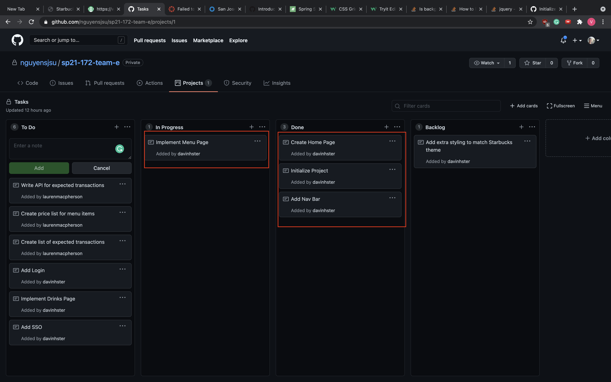

# Week 1 Notes for Vinh Nguyen

### self notes
* Issue 1: Having issues with linking an image from a different path
    * **Solution: Thymeleaf processes images in static/images and we use th:src="@{/images/starbuckslogo.png} to access image**

# Snapshot
* 

# Discussion

## Accomplishments (only the notable commits, I left out the bug fix commits... etc)
* https://github.com/nguyensjsu/sp21-172-team-e/commit/6161bde0ad120ced5c97099352a4dcba910717cc
    * Added Spring starter files
* https://github.com/nguyensjsu/sp21-172-team-e/commit/c063b1634b044d48b2347019c5b765c4e1bcd97d
    * Added Journal folders so that we can write our own individual reports in that folder
* https://github.com/nguyensjsu/sp21-172-team-e/commit/c5e838574c6295eb4a544cc02ab2fdc73e2e329f
    * I used bootstrap to create the Navbar and added the starbucks logo to indicate a starbucks clone
* https://github.com/nguyensjsu/sp21-172-team-e/commit/4c091975a070f4c4258772e7676030e8438cd734
    * Added a menu list with 4 items that we are going to implement on the online store. 

## Challenges
* The initial start was bumpy since I had to dig deeper to learn more about Thymeleaf and learning to how to create my own templates without starter code or any intermediate steps on how to reach that specific goal
    * to solve this, I had to learn some technical skills like html and css by using https://www.w3schools.com/ to practice my html and css skills
* Another challenge that I am facing is learning how to dynamically add websites. The current issue is that I would have to create a static html for every drink and if I wanted to update that page, I would have to do this for every drink which would be messy.
    * I haven't solved this problem yet, but I am learning with online tutorials that teach me how to pass parameters into a html template so only the base template gets changed every time I make an edit to the page.