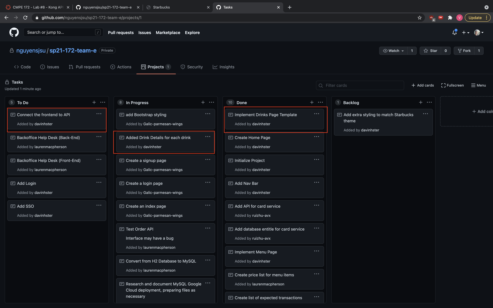

# Week 2 Notes for Vinh Nguyen

### self notes
* 

# Snapshot
* 

# Discussion

## Accomplishments (only the notable commits, I left out the bug fix commits... etc)
* https://github.com/nguyensjsu/sp21-172-team-e/commit/256c458566cdb3795ee1300d9a8a8e9c6a1edbec
    * Added web controller features to allow passing thymeleaf url's to the controller creating dynamic html files that change based on what the url parameters.  
## Challenges

* I figured out how to pass the variables to a drinks template so we don't have to hard code each html file when we need to change drink
    * Now I just need to figure out how we can pass in specific drink messages without having to hard code it in the controller
    * I am thinking of creating an interface called Drink and then passing the type of drink that implements the drink to get the message, cost, and pictures
        * Need to learn some java concepts to implement this feature
* I also need to figure out how we can connect the front end to the API as they are pretty much disconnected.
* There are also some things we need to add to bring them together like having an account, to keep track of these orders and drinks. We need to figure out how we can work on front end and backend seperately and then learning how to combine the two features.