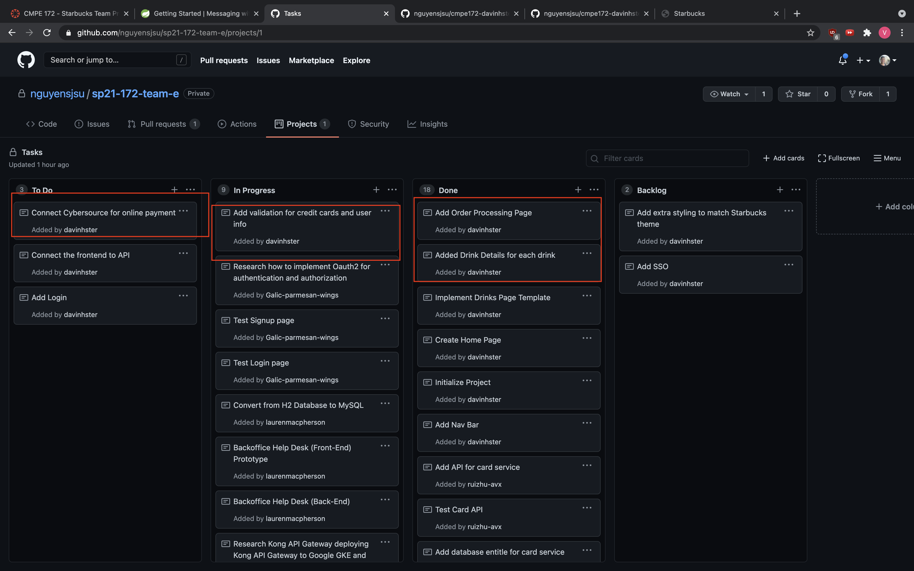

# Week 3 Notes for Vinh Nguyen

# Snapshot
* 

# Discussion

## Accomplishments (only the notable commits, I left out the bug fix commits... etc)
* https://github.com/nguyensjsu/sp21-172-team-e/commit/a8e5b380dff7cebec1ed55fb13bb9fbeec97c541
    * Added the routing page for orders and added details for each drink
* https://github.com/nguyensjsu/sp21-172-team-e/commit/4a4211395d05ae01e1ff79b3ffd93dc0dc7a2a1a
    * Added the form page for customers to input data
* https://github.com/nguyensjsu/sp21-172-team-e/commit/b7f6fd748b92c8aa08ae208fce9a1de036ac83db
    * Added form validation for order processing.

## Challenges

* A challenge that I am having is trying to keep the states of orders for add to cart. Currently our implementation has a bare minimum of add 1 drink and the order process. Will have to figure out how we can add multiple drinks to the card before we process the order.
* Another challenge that I am facing is figuring out how to pass in the drink details to the order page. Maybe we can pass it from html to controller. and then in the order page we display the same details along with the customer order page. 
* While importing the customer info I ran into 
    * `Caused by: java.lang.IllegalStateException: Neither BindingResult nor plain target object for bean name 'command' available as request attribute`
        * Attempt 1: I'm probably missing the commands.java file for the inputs
            * **turns out I just needed to add a GetMapping and a PostMapping**
* Issue mapping a post button with the controller. Not sure if it is a html problem of a controller problem
    * **I just needed to have lower case "post" instead of "POST" in the form method**
* For next week, I need to figure out how to connect cybersource API with our generated credit card in the correct format

    