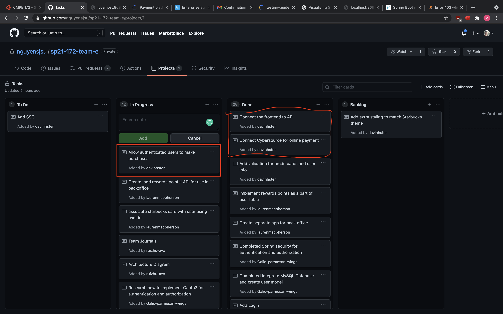

# Week 4 Notes for Vinh Nguyen

# Snapshot
* 

# Discussion

## Accomplishments (only the notable commits, I left out the bug fix commits... etc)
* https://github.com/nguyensjsu/sp21-172-team-e/commit/fff59d824584d8493d6104b05849d7b3e77ec20d
    * Added cybersource API
* https://github.com/nguyensjsu/sp21-172-team-e/commit/8c6a8b77f11c2e5daab14c26104ca6e7bd5c42b4
    * Connected Authenticated Users to all other pages besides home page
* https://github.com/nguyensjsu/sp21-172-team-e/commit/8c6a8b77f11c2e5daab14c26104ca6e7bd5c42b4
    * Users have to be authenticated to do post actions

## Challenges

* A challenge that I was facing was combining my group's navbar with the new authentication. When trying to merge my pages together, the CSS would get messed up and authentication was only to the home page
    * To fix this, I had to add some extra CSS under the static folder for my styling to appear with the navbar. 
* I also had issues with thymeleaf fragments. The fragements would not be placed correctly leading to a lot of misplaced containers. 
    * To fix this, I had to look up the definitions for th:fragment, th:include, and th:replace and understand how they work and learned how to override the templates on different pages
* Another challenege was now that the user is authenticated, I have to figure out how we can allow post methods, because it always results in a forbidden action error 403
    * Fixed: just needed to add th:action="@{/pay/{id}(id=${drinkname})}" in the forms 
    